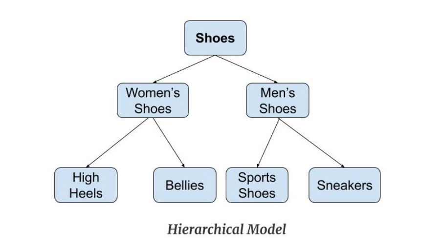

# DATABASE MODEL

A DATABASE model is a logical structure that defines how the data is organized and relationships are made in the database.
It serves as a blueprint for designing and implementing a database system.
There are several types of database models

### 1.Relational Database Model:

=> Data is organized into tables with rows and columns.
=> Tables are related to each other through keys (primary and foreign keys).
=> Examples of relational database systems include MySQL, PostgreSQL, Oracle, and Microsoft SQL Server.

### 2.Hierarchical Database Model:

