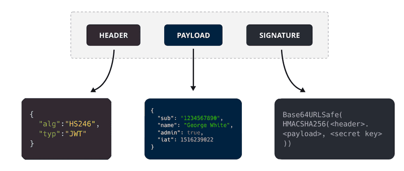

# JWT 

JSON Web Tokens (JWTs) are a standardized way to securely transmit information between parties as a JSON object. They are widely used in authentication and authorization processes. 
They contain JSON objects which have the information that needs to be shared. Each JWT is also signed using cryptography (hashing) to ensure that the JSON contents cannot be affected by the malicious party.
When respone is send from auth server there is no way that API's can verify the authenticity of the data. Due to this, the auth server needs to transmit this information in a way that can be verified by the client application, and this is where the concept of a TOKEN comes into the picture. 

### Token 

A token is a string that contains some information that can be verified securely. It could be a random set of alphanumeric characters which point to an ID in the database, or it could be an encoded JSON that can be self-verified



This token generally consists of 3 parts  
```text
1) Header: Consists of two parts:  
    a)The signing algorithm that’s being used.  
    The type of token, which, in this case, is mostly “JWT”.  